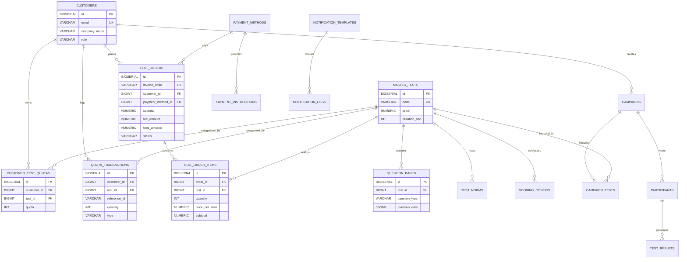

# Database Schema, ERD, and Seed Data - PsikoTest.id Enterprise

## 1. Entity Relationship Diagram (ERD)



---

## 2. DDL Schema & High-Traffic Optimization Indexes
The following schema uses `BIGSERIAL` for IDs, `VARCHAR` with `CHECK` constraints instead of PostgreSQL `ENUM`, and high-traffic optimization indexes for indexing performance.

```sql
-- ==============================================================================
-- PSIKOTEST.ID - OPTIMIZED B2B SAAS SCHEMA WITH DIRECT PAY-PER-TEST QUOTA MODEL
-- ==============================================================================

-- 1. TABEL CUSTOMERS (HRD Klien & Super Admin)
CREATE TABLE customers (
    id BIGSERIAL PRIMARY KEY,
    auth_user_id VARCHAR(255) UNIQUE, 
    email VARCHAR(255) NOT NULL UNIQUE,
    company_name VARCHAR(255) NOT NULL,
    phone_number VARCHAR(50),
    logo_url VARCHAR(1024),
    brand_color VARCHAR(20) DEFAULT '#2563eb',
    role VARCHAR(50) DEFAULT 'CUSTOMER' CHECK (role IN ('CUSTOMER', 'SUPERADMIN')),
    status VARCHAR(20) DEFAULT 'ACTIVE' CHECK (status IN ('ACTIVE', 'SUSPENDED')),
    created_at TIMESTAMPTZ DEFAULT NOW()
);

-- 2. TABEL MASTER TESTS
CREATE TABLE master_tests (
    id BIGSERIAL PRIMARY KEY,
    code VARCHAR(50) NOT NULL UNIQUE,
    name VARCHAR(255) NOT NULL,
    description TEXT,
    duration_sec INT NOT NULL DEFAULT 0,
    price NUMERIC(10, 2) NOT NULL DEFAULT 0.00,
    instructions TEXT,
    is_active BOOLEAN DEFAULT TRUE,
    created_at TIMESTAMPTZ DEFAULT NOW()
);

-- 3. TABEL QUESTION BANKS
CREATE TABLE question_banks (
    id BIGSERIAL PRIMARY KEY,
    test_id BIGINT NOT NULL REFERENCES master_tests(id) ON DELETE CASCADE,
    question_type VARCHAR(50) NOT NULL CHECK (question_type IN ('multiple_choice', 'true_false', 'short_answer', 'essay')),
    question_data JSONB NOT NULL,
    order_number INT NOT NULL,
    created_at TIMESTAMPTZ DEFAULT NOW()
);

-- 4. TABEL NORMS & SCORING CONFIGS
CREATE TABLE scoring_configs (
    id BIGSERIAL PRIMARY KEY,
    test_id BIGINT NOT NULL UNIQUE REFERENCES master_tests(id) ON DELETE CASCADE,
    formula_type VARCHAR(100) NOT NULL,
    config_data JSONB NOT NULL,
    created_at TIMESTAMPTZ DEFAULT NOW()
);

CREATE TABLE test_norms (
    id BIGSERIAL PRIMARY KEY,
    test_id BIGINT NOT NULL REFERENCES master_tests(id) ON DELETE CASCADE,
    raw_score VARCHAR(50) NOT NULL,
    norm_score VARCHAR(50) NOT NULL,
    label VARCHAR(100),
    description TEXT,
    created_at TIMESTAMPTZ DEFAULT NOW()
);

-- 5. TABEL CAMPAIGNS & PARTICIPANTS
CREATE TABLE campaigns (
    id BIGSERIAL PRIMARY KEY,
    customer_id BIGINT NOT NULL REFERENCES customers(id) ON DELETE CASCADE,
    title VARCHAR(255) NOT NULL,
    is_active BOOLEAN DEFAULT TRUE,
    created_at TIMESTAMPTZ DEFAULT NOW()
);

CREATE TABLE campaign_tests (
    campaign_id BIGINT NOT NULL REFERENCES campaigns(id) ON DELETE CASCADE,
    test_id BIGINT NOT NULL REFERENCES master_tests(id) ON DELETE CASCADE,
    PRIMARY KEY (campaign_id, test_id)
);

CREATE TABLE participants (
    id BIGSERIAL PRIMARY KEY,
    campaign_id BIGINT NOT NULL REFERENCES campaigns(id) ON DELETE CASCADE,
    full_name VARCHAR(255) NOT NULL,
    email VARCHAR(255) NOT NULL,
    phone_number VARCHAR(50),
    status VARCHAR(50) DEFAULT 'RUNNING' CHECK (status IN ('RUNNING', 'COMPLETED')),
    created_at TIMESTAMPTZ DEFAULT NOW()
);

CREATE TABLE test_results (
    id BIGSERIAL PRIMARY KEY,
    participant_id BIGINT NOT NULL REFERENCES participants(id) ON DELETE CASCADE,
    test_id BIGINT NOT NULL REFERENCES master_tests(id) ON DELETE CASCADE,
    raw_answers JSONB NOT NULL,
    scoring_data JSONB,
    created_at TIMESTAMPTZ DEFAULT NOW(),
    UNIQUE (participant_id, test_id)
);

-- ==============================================================================
-- MODUL PEMBELIAN QUOTA LANGSUNG (Direct Pay-Per-Test Billing)
-- ==============================================================================

CREATE TABLE payment_methods (
    id BIGSERIAL PRIMARY KEY,
    code VARCHAR(50) NOT NULL UNIQUE,
    name VARCHAR(100) NOT NULL,
    logo_url VARCHAR(1024),
    type VARCHAR(50) NOT NULL,
    provider VARCHAR(50) NOT NULL,
    admin_fee_flat NUMERIC(10,2) DEFAULT 0.00,
    admin_fee_pct NUMERIC(5,2) DEFAULT 0.00,
    is_active BOOLEAN DEFAULT TRUE,
    sort_order INT DEFAULT 0
);

CREATE TABLE payment_instructions (
    id BIGSERIAL PRIMARY KEY,
    payment_method_id BIGINT NOT NULL REFERENCES payment_methods(id) ON DELETE CASCADE,
    title VARCHAR(255) NOT NULL,
    content TEXT NOT NULL,
    sort_order INT DEFAULT 0,
    created_at TIMESTAMPTZ DEFAULT NOW()
);

-- Menggantikan top_up_requests
CREATE TABLE test_orders (
    id BIGSERIAL PRIMARY KEY,
    invoice_code VARCHAR(100) NOT NULL UNIQUE,
    customer_id BIGINT NOT NULL REFERENCES customers(id) ON DELETE CASCADE,
    payment_method_id BIGINT REFERENCES payment_methods(id) ON DELETE SET NULL,
    subtotal NUMERIC(15, 2) NOT NULL,
    fee_amount NUMERIC(15, 2) DEFAULT 0.00,
    total_amount NUMERIC(15, 2) NOT NULL,
    payment_url VARCHAR(1024),
    payment_token VARCHAR(255),
    proof_url VARCHAR(1024),
    status VARCHAR(50) DEFAULT 'PENDING' CHECK (status IN ('PENDING', 'PAID', 'CANCELLED', 'FAILED', 'EXPIRED')),
    created_at TIMESTAMPTZ DEFAULT NOW(),
    paid_at TIMESTAMPTZ
);

CREATE TABLE test_order_items (
    id BIGSERIAL PRIMARY KEY,
    order_id BIGINT NOT NULL REFERENCES test_orders(id) ON DELETE CASCADE,
    test_id BIGINT NOT NULL REFERENCES master_tests(id) ON DELETE CASCADE,
    quantity INT NOT NULL CHECK (quantity > 0),
    price_per_item NUMERIC(10, 2) NOT NULL,
    subtotal NUMERIC(15, 2) NOT NULL,
    created_at TIMESTAMPTZ DEFAULT NOW()
);

-- Menyimpan akumulasi kuota per tipe tes per customer
CREATE TABLE customer_test_quotas (
    id BIGSERIAL PRIMARY KEY,
    customer_id BIGINT NOT NULL REFERENCES customers(id) ON DELETE CASCADE,
    test_id BIGINT NOT NULL REFERENCES master_tests(id) ON DELETE CASCADE,
    quota INT NOT NULL DEFAULT 0 CHECK (quota >= 0),
    updated_at TIMESTAMPTZ DEFAULT NOW(),
    UNIQUE (customer_id, test_id)
);

-- Log transaksi mutasi kuota (Menggantikan transactions)
CREATE TABLE quota_transactions (
    id BIGSERIAL PRIMARY KEY,
    customer_id BIGINT NOT NULL REFERENCES customers(id) ON DELETE CASCADE,
    test_id BIGINT NOT NULL REFERENCES master_tests(id) ON DELETE CASCADE,
    reference_id VARCHAR(100), -- Order invoice code (CREDIT) atau Participant ID (DEBIT)
    quantity INT NOT NULL,     -- Positif untuk penambahan, Negatif untuk pengurangan
    type VARCHAR(50) NOT NULL CHECK (type IN ('CREDIT', 'DEBIT')),
    description VARCHAR(255) NOT NULL,
    created_at TIMESTAMPTZ DEFAULT NOW()
);

CREATE TABLE payment_logs (
    id BIGSERIAL PRIMARY KEY,
    invoice_code VARCHAR(100) NOT NULL,
    endpoint VARCHAR(255),
    type VARCHAR(50),
    request_payload TEXT,
    response_payload TEXT,
    http_status INT,
    created_at TIMESTAMPTZ DEFAULT NOW()
);

-- ==============================================================================
-- MODUL NOTIFIKASI
-- ==============================================================================

CREATE TABLE notification_templates (
    id BIGSERIAL PRIMARY KEY,
    event_trigger VARCHAR(50) NOT NULL UNIQUE,
    channel VARCHAR(20) NOT NULL CHECK (channel IN ('WHATSAPP', 'EMAIL')),
    message_content TEXT NOT NULL,
    is_active BOOLEAN DEFAULT TRUE
);

CREATE TABLE notification_logs (
    id BIGSERIAL PRIMARY KEY,
    template_id BIGINT REFERENCES notification_templates(id) ON DELETE SET NULL,
    reference_code VARCHAR(100),
    recipient VARCHAR(150) NOT NULL,
    channel VARCHAR(20) NOT NULL,
    request_payload TEXT,
    response_payload TEXT,
    status VARCHAR(20) CHECK (status IN ('SUCCESS', 'FAILED', 'PENDING')),
    created_at TIMESTAMPTZ DEFAULT NOW()
);

-- ==========================================
-- OPTIMISASI INDEXES (High Traffic)
-- ==========================================
CREATE INDEX idx_campaigns_customer ON campaigns(customer_id);
CREATE INDEX idx_participants_campaign ON participants(campaign_id);
CREATE INDEX idx_test_results_part_test ON test_results(participant_id, test_id);
CREATE INDEX idx_question_banks_test_order ON question_banks(test_id, order_number);
CREATE INDEX idx_test_orders_invoice ON test_orders(invoice_code);
CREATE INDEX idx_test_orders_customer ON test_orders(customer_id);
CREATE INDEX idx_test_order_items_order ON test_order_items(order_id);
CREATE INDEX idx_customer_test_quotas_customer_test ON customer_test_quotas(customer_id, test_id);
CREATE INDEX idx_quota_transactions_customer_test ON quota_transactions(customer_id, test_id, created_at DESC);
CREATE INDEX idx_payment_logs_invoice ON payment_logs(invoice_code);
CREATE INDEX idx_notification_logs_ref ON notification_logs(reference_code);

```

---

## 3. Real-World Seed Data (DML)
Data simulasi realistis untuk konteks B2B di Indonesia. Semua sequence di-reset di akhir eksekusi agar pengisian data selanjutnya tidak mengalami kendala indeks kunci primer.

```sql
-- ==========================================
-- SEEDING DATA
-- ==========================================

-- 1. CUSTOMERS (Tidak ada kolom balance)
INSERT INTO customers (id, email, company_name, phone_number, logo_url, brand_color, role) VALUES
(1, 'admin@psikotest.id', 'PsikoTest.id HQ', '6281234567890', 'https://images.pexels.com/photos/1337380/pexels-photo-1337380.jpeg', '#16a34a', 'SUPERADMIN'),
(2, 'hrd@telkomsel.co.id', 'PT Telekomunikasi Selular', '628111111111', 'https://images.pexels.com/photos/269077/pexels-photo-269077.jpeg', '#e11d48', 'CUSTOMER'),
(3, 'rekrutmen@gojek.com', 'PT GoTo Gojek Tokopedia', '628122222222', 'https://images.pexels.com/photos/323780/pexels-photo-323780.jpeg', '#059669', 'CUSTOMER');

-- 2. MASTER TESTS
INSERT INTO master_tests (id, code, name, description, duration_sec, price, instructions, is_active) VALUES
(1, 'wpt', 'Wonderlic Personnel Test', 'Tes kognitif dan logika penyelesaian masalah', 720, 35000.00, 'Selesaikan sebanyak mungkin pertanyaan dengan tepat dalam waktu 12 menit.', TRUE),
(2, 'disc', 'DISC Personality', 'Asesmen 4 kuadran kepribadian dominan', 600, 25000.00, 'Pilih satu pernyataan yang PALING dan KURANG menggambarkan diri Anda di lingkungan kerja.', TRUE),
(3, 'tech_js', 'Javascript Developer Assessment', 'Tes teknikal pemrograman Javascript menengah-lanjut', 1800, 50000.00, 'Jawablah pertanyaan teoritis dan berikan penjelasan konseptual singkat.', TRUE);

-- 3. QUESTION BANKS (Berbagai jenis tipe soal)
INSERT INTO question_banks (test_id, question_type, question_data, order_number) VALUES
-- Tipe Multiple Choice (Jumlah opsi fleksibel)
(1, 'multiple_choice', '{"text": "Bulan lalu pada awal tahun ini adalah:", "options": ["Januari", "Maret", "Juli", "Desember", "Oktober"]}', 1),
(1, 'multiple_choice', '{"text": "MENANGKAP adalah lawan kata dari:", "options": ["Meletakkan", "Membebaskan", "Beresiko", "Berusaha", "Turun tingkat", "Melepaskan"]}', 2),

-- Tipe True/False
(1, 'true_false', '{"text": "Apakah kata KLIEN dan PELANGGAN memiliki arti yang persis sama dalam konteks hukum tata negara?"}', 3),

-- Tipe Short Answer
(1, 'short_answer', '{"text": "Sebuah pesawat terbang 300 kaki dalam 0.5 detik. Pada kecepatan yang sama berapa kaki ia terbang dalam 10 detik?"}', 4),

-- Tipe Essay
(3, 'essay', '{"text": "Jelaskan perbedaan mendasar antara eksekusi Synchronous dan Asynchronous di ekosistem Node.js, sertakan contoh sederhana penggunaan Promises!"}', 1),

-- Tipe Multiple Choice untuk DISC
(2, 'multiple_choice', '{"text": "Pilih satu pernyataan yang PALING menggambarkan Anda:", "options": ["Mudah bergaul, ramah", "Sangat teliti dan akurat", "Tegas dan suka memimpin", "Tenang, stabil, sabar"]}', 1);

-- 4. SCORING CONFIGS & NORMS
INSERT INTO scoring_configs (test_id, formula_type, config_data) VALUES
(1, 'matching_key', '{"key": {"1": "4", "2": "2", "3": "false", "4": "6000"}}'),
(2, 'disc_matrix', '{"matrix_p": {"1": ["I","C","D","S"]}, "matrix_k": {"1": ["C","I","S","D"]}}');

INSERT INTO test_norms (test_id, raw_score, norm_score, label, description) VALUES
(2, 'DI', 'Dominance-Influence', 'Result Oriented', 'Kandidat memiliki pengaruh dan ketegasan tinggi. Sangat cocok sebagai inovator atau pemimpin proyek yang dinamis.'),
(2, 'SC', 'Steadiness-Compliance', 'Detail Oriented', 'Kandidat sangat stabil, teliti, dan menyukai keteraturan. Andal dalam menangani infrastruktur sistem berskala besar.'),
(1, '20', '100', 'Average', 'Kapasitas intelektual dan kognitif umum berada pada tingkat rata-rata populasi.'),
(1, '35', '120', 'Superior', 'Kapasitas analitis sangat baik, mampu memecahkan arsitektur permasalahan yang rumit dengan cepat.');

-- 5. CAMPAIGNS & PARTICIPANTS
INSERT INTO campaigns (id, customer_id, title, is_active) VALUES
(1, 2, 'Seleksi Manajer IT Telkomsel', TRUE),
(2, 3, 'Rekrutmen Driver Acquisition Gojek', TRUE);

INSERT INTO campaign_tests (campaign_id, test_id) VALUES
(1, 1), (1, 2), (1, 3), -- Campaign 1: WPT, DISC, JS
(2, 2);                 -- Campaign 2: Hanya DISC

INSERT INTO participants (id, campaign_id, full_name, email, status) VALUES
(1, 1, 'Budi Santoso', 'budi.santoso@email.com', 'COMPLETED'),
(2, 1, 'Siti Rahma', 'siti.rahma@email.com', 'RUNNING'),
(3, 2, 'Ahmad Reza', 'ahmad.reza@email.com', 'COMPLETED');

INSERT INTO test_results (participant_id, test_id, raw_answers, scoring_data) VALUES
(1, 1, '{"1": "4", "2": "2", "3": "false", "4": "6000"}', '{"raw": 4, "score": 120, "label": "Superior", "description": "Kapasitas analitis sangat baik."}');

-- 6. PAYMENT METHODS & INSTRUCTIONS
INSERT INTO payment_methods (id, code, name, type, provider, admin_fee_flat, is_active, sort_order) VALUES
(1, 'BCA_VA', 'BCA Virtual Account', 'va', 'Xendit', 4000.00, TRUE, 1),
(2, 'MANDIRI_VA', 'Mandiri Virtual Account', 'va', 'Xendit', 4000.00, TRUE, 2),
(3, 'QRIS', 'QRIS (All Payment)', 'qr_code', 'Xendit', 0.00, TRUE, 3),
(4, 'MANUAL_BCA', 'BCA Transfer Manual', 'bank_transfer', 'Manual', 0.00, TRUE, 4);

INSERT INTO payment_instructions (payment_method_id, title, content, sort_order) VALUES
(1, 'Pembayaran via m-BCA', '<ol><li>Buka aplikasi m-BCA</li><li>Pilih m-Transfer > BCA Virtual Account</li><li>Masukkan nomor VA</li><li>Konfirmasi nominal Pembayaran</li></ol>', 1),
(3, 'Pembayaran via QRIS', '<ol><li>Buka aplikasi e-Wallet (GoPay, OVO, Dana) atau m-Banking</li><li>Pilih menu Scan QRIS</li><li>Arahkan kamera ke QR Code di layar</li></ol>', 1),
(4, 'Transfer Manual', '<ol><li>Transfer ke Rekening BCA: 123456789 a.n PT PsikoTest Solusi</li><li>Pastikan nominal transfer sama persis</li><li>Unggah bukti transfer di dashboard Admin</li></ol>', 1);

-- 7. INITIAL CUSTOMER TEST QUOTAS (Klien memiliki kuota tersendiri per tes)
INSERT INTO customer_test_quotas (customer_id, test_id, quota) VALUES
(2, 1, 150), -- Telkomsel has 150 WPT quotas
(2, 2, 200), -- Telkomsel has 200 DISC quotas
(2, 3, 100), -- Telkomsel has 100 Javascript quotas
(3, 2, 45);  -- Gojek has 45 DISC quotas

-- 8. TEST ORDERS & ITEMS (Menggantikan top_up_requests)
INSERT INTO test_orders (id, invoice_code, customer_id, payment_method_id, subtotal, fee_amount, total_amount, status, paid_at) VALUES
(1, 'ORD-20260613-001', 3, 1, 1125000.00, 4000.00, 1129000.00, 'PAID', '2026-06-13T09:00:00Z'),
(2, 'ORD-20260613-002', 3, 4, 2500000.00, 0.00, 2500000.00, 'PENDING', NULL);

INSERT INTO test_order_items (order_id, test_id, quantity, price_per_item, subtotal) VALUES
(1, 2, 45, 25000.00, 1125000.00), -- Gojek ordered 45 DISC tests
(2, 3, 50, 50000.00, 2500000.00); -- Gojek pending order for 50 Javascript tests

-- 9. QUOTA TRANSACTIONS (Mutasi kuota masuk/keluar)
INSERT INTO quota_transactions (customer_id, test_id, reference_id, quantity, type, description) VALUES
(3, 2, 'ORD-20260613-001', 45, 'CREDIT', 'Pembelian kuota DISC via BCA Virtual Account'),
(2, 1, 'PART-1', -1, 'DEBIT', 'Penggunaan kuota WPT: Budi Santoso (Seleksi Manajer IT Telkomsel)');

-- 10. NOTIFICATION TEMPLATES (Template disesuaikan dengan kuota dan pesanan)
INSERT INTO notification_templates (id, event_trigger, channel, message_content) VALUES
(1, 'ORDER_PAID', 'WHATSAPP', 'Halo HRD {company_name}, pembayaran pesanan kuota sebesar Rp {amount} dengan Invoice {invoice_code} BERHASIL. Kuota tes Anda telah berhasil didepositkan.'),
(2, 'ORDER_PENDING', 'WHATSAPP', 'Halo HRD {company_name}, pesanan kuota Anda sebesar Rp {total_amount} menunggu pembayaran. Silakan selesaikan pembayaran lewat {payment_method}.'),
(3, 'ASSESSMENT_INVITE', 'EMAIL', 'Yth. {participant_name}, Anda diundang oleh {company_name} untuk mengikuti tes asesmen. Silakan klik link berikut: {assessment_link}');

-- ==============================================================================
-- 4. SEQUENCE RESETS (Critical for subsequent Inserts)
-- ==============================================================================
SELECT setval('customers_id_seq', (SELECT MAX(id) FROM customers));
SELECT setval('master_tests_id_seq', (SELECT MAX(id) FROM master_tests));
SELECT setval('question_banks_id_seq', (SELECT MAX(id) FROM question_banks));
SELECT setval('scoring_configs_id_seq', (SELECT MAX(id) FROM scoring_configs));
SELECT setval('test_norms_id_seq', (SELECT MAX(id) FROM test_norms));
SELECT setval('campaigns_id_seq', (SELECT MAX(id) FROM campaigns));
SELECT setval('participants_id_seq', (SELECT MAX(id) FROM participants));
SELECT setval('test_results_id_seq', (SELECT MAX(id) FROM test_results));
SELECT setval('payment_methods_id_seq', (SELECT MAX(id) FROM payment_methods));
SELECT setval('payment_instructions_id_seq', (SELECT MAX(id) FROM payment_instructions));
SELECT setval('test_orders_id_seq', (SELECT MAX(id) FROM test_orders));
SELECT setval('test_order_items_id_seq', (SELECT MAX(id) FROM test_order_items));
SELECT setval('customer_test_quotas_id_seq', (SELECT MAX(id) FROM customer_test_quotas));
SELECT setval('quota_transactions_id_seq', (SELECT MAX(id) FROM quota_transactions));
SELECT setval('payment_logs_id_seq', (SELECT MAX(id) FROM payment_logs));
SELECT setval('notification_templates_id_seq', (SELECT MAX(id) FROM notification_templates));
SELECT setval('notification_logs_id_seq', (SELECT MAX(id) FROM notification_logs));